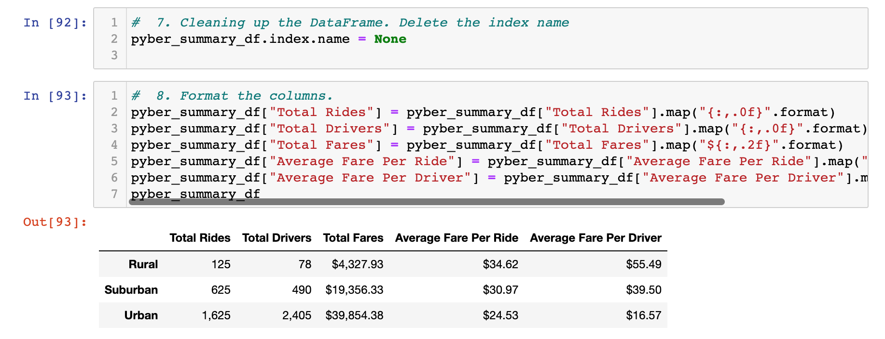
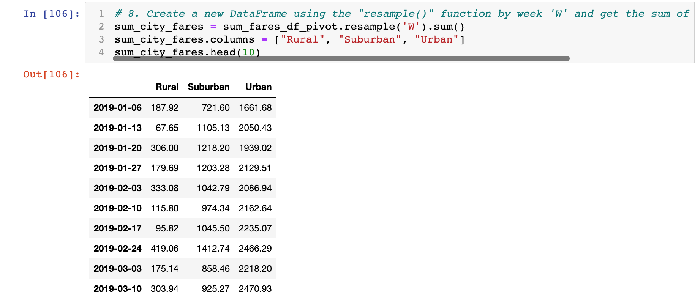
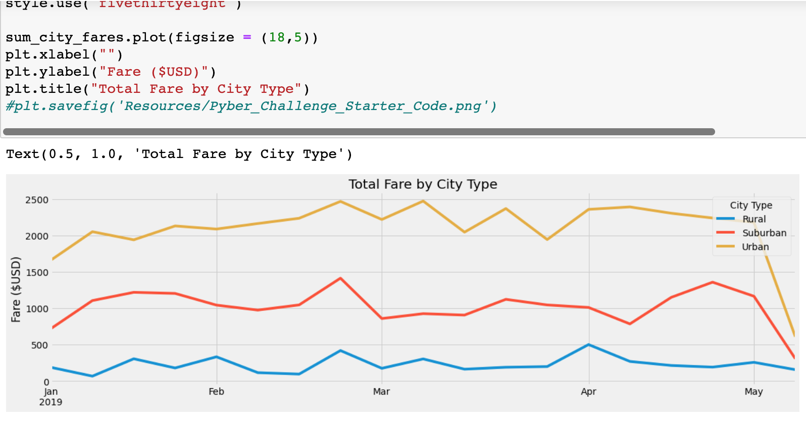

# PyBer_Analysis

## Overview
  The purpose of this analysis was to first create a summary DataFrame of the ride-sharing data by each city type: "Urban", "Suburban" and "Rural". I was then asked to create a multiple-line graph that shows the total weekly fares for each city type. 

## Results
  For Deliverable one, I was instructed to to use the starter code given to get the total number of rides, drivers, and fares for each city type. Then I was requested to find the average fare per driver for each city type and create a new DataFrame with this infomration. For Deliverable 1, the rural city type had a vastly smaller amount of rides compared to the suburban and urban types. The rural type has 125 rides while suburban had 625 and urban had 1625 total rides. Despite this, the rural type has the most expensive trip costs as well as the highest average fare per driver. The suburban and urban fares per ride were $24.53 and $30.97 respectively while the rural fares were $34.62. This can also be said for the driver count as well as the average fare per driver. There were only 78 rural type drivers while the average fare was $55.49. Suburban and Urban (with 490 for suburban and 2,405 drivers for urban) had cheapter fares with $30.97 and $24.53 per ride as well as $39.50 and $16.57 average fare per driver.
  
### PyBer Summary

  
  In Deliverable two, I created a DataFrame for the summary of the fares for each city type and then plotted the data on a multiple-line showing how much the sum of the fares would change over the span of a couple of months. According to Deliverable two, the rural had the least expesive fares each week while the urban had the most expensive fares. The rural fare went as low as $67.65 on 01-13-2019 while the urban fare went as high as $2,466.29 on 02-24-2019. The suburban city type, just like in Deliverable one, sat in the middle of the two ranges having fares that were more expensive than the rural city type but it never reached the expenses of the urban cityt type. This can also be seen in the graph where the red suburban line stayed in the middle of the two other types with no intersections at any point. 

### Sum of City Type Fares

### PyBer Multiple-Line Graph

## Summary
  Based on the ride-sharing data, I do have some reccomendations that can address some of the results of the data as a whole. The first thing I would do is increase the driver count especially in the rural areas. The amount of drivers in suburban areas is about six times more than in rural areas with only 78 drivers. This is most likely because rural areas consist of much longer rides with can be time-consuming over a long period. Also this change can lower the prices of the average fare due to the fact that not many rides go to rural areas. The lack of rides cause the rates to be much higher compared to the subruban and urban areas which can be seen in Deliverable one. 
  
  Another reccomendation would be to find a way to increase ride counts in suburban areas by having more drivers available since suburban fares cover about 30%. This is a large percentage based on the amount of drivers available. So imporving service in that area can help provide more rides in suburban areas and in the future remove some of the dips that were shown in the graph for the month of February going into March.  
  
  In addition, I think another great addition to help with all city types across the board would be to have certain benefits or rewards based on the amunt of rides taken for the customer. For example, after a certain number of rides a customer can get one ride for free. I think rewards such as a free ride can incentivise a customer to keep getting ride no matter where they are which can help bump up ride counts across all city types since there is a good reason to keep getting rides. Another incentive can be if a driver recieves an amazing review, the driver can get a reward or be a standout in the company for thier great work which shows that good service is appreciated and noticed. I think rewards such as these can provide another on the job incentive to increase rides in all areas as well as have great customer service so then the customer can ride-share more often. These incentives can help iron out the dips that occured throughtout all three city types that all seemed to occur around the end of Fenruary as well as in March.
  
## Resources
- Anaconda version 2.1.1
- Jupyter Notebook version 6.4.5
- Python version 3.9.7
- Pandas version 1.3.4

